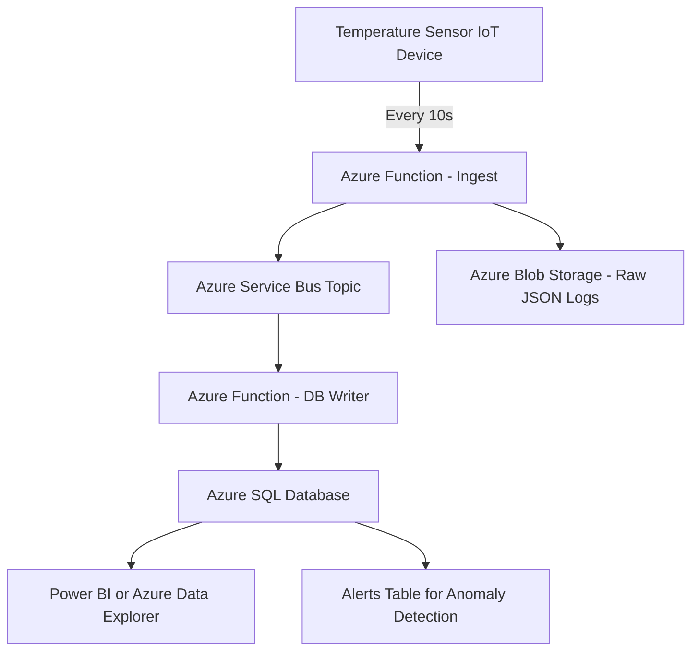
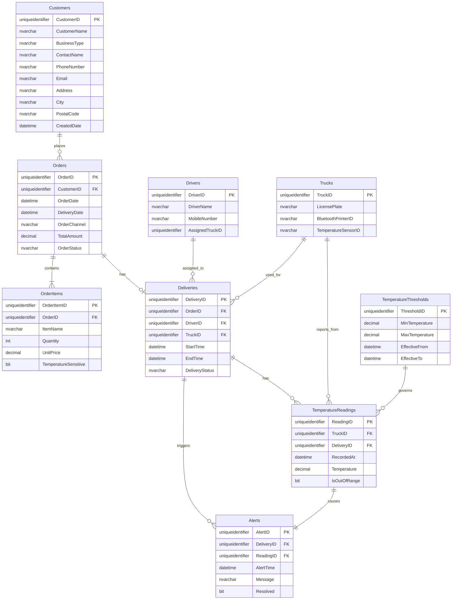
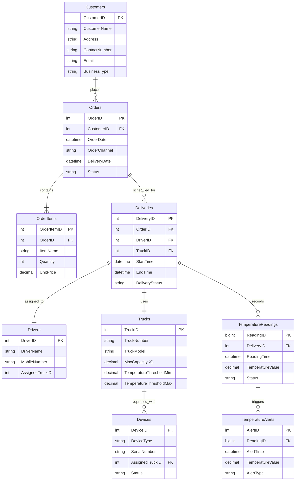

---

### 🍽️ **Scenario Summary:**

Client is the UK's leading food service delivery and collection provider. It supplies food items across the UK to customers of varied business like restaurants, cafes etc. It delivers high-quality food items to 30,000 plus customers. Client had two sales channels - website and call center through which customers order online and also request for delivery of food items. To make the business process more efficient and intelligent, client wanted to automate the business by taking a step further where drivers could deliver through IoT-connected mobile devices such as Bluetooth printers and Bluetooth temperature sensors mounted in trucks. By deploying this advanced technology client wanted to provide a differentiated service and delight customers. During the delivery of items, if the temperature is not optimal then there is a risk of customer returning the goods. To avoid this situation, client wanted to monitor the real-time temperature of the truck periodically and check if it is within the optimal range and doesn’t go beyond the standard temperature limits or thresholds. Client needed the real-time temperature sensor data tracking for every 10 seconds and its visual output for analytics.

The client delivers food items to over 30,000 customers across the UK via two primary channels: **website** and **call center**. The client aims to:

- Use **IoT-connected devices** like Bluetooth temperature sensors and printers.
- Monitor **real-time truck temperature every 10 seconds**.
- Raise alerts if the **temperature exceeds thresholds**.
- Reduce return risk by ensuring **cold chain integrity**.
- Enable **real-time analytics** on delivery data.

---

## ✅ Updated IoT Delivery Tracking Solution – Azure-Based Architecture

### 🧭 Architecture Overview




Based on your scenario, here’s a detailed breakdown of the **SQL database schema** using `uniqueidentifier` as primary keys, to support **real-time IoT temperature monitoring**, **delivery tracking**, and **customer satisfaction assurance** for a food delivery operation. This schema allows integration of IoT data, delivery management, and analytics.

---

## 🧠 **Scenario Summary**

The client is the UK's leading food service delivery provider with over 30,000 B2B customers. Orders come via a website or call center. To ensure food quality during deliveries, trucks are equipped with Bluetooth printers and temperature sensors. Real-time temperature readings every 10 seconds are logged to prevent spoilage. If temperatures exceed thresholds, alerts are raised, reducing the chance of rejected goods.

---

## 🗂️ **SQL Database Tables with `uniqueidentifier`**

### 1. **Customers**

```sql
CREATE TABLE Customers (
    CustomerID UNIQUEIDENTIFIER PRIMARY KEY DEFAULT NEWID(),
    CustomerName NVARCHAR(255),
    BusinessType NVARCHAR(100), -- e.g., Restaurant, Café, Retailer
    ContactName NVARCHAR(255),
    PhoneNumber NVARCHAR(50),
    Email NVARCHAR(255),
    Address NVARCHAR(255),
    City NVARCHAR(100),
    PostalCode NVARCHAR(20),
    CreatedDate DATETIME DEFAULT GETDATE()
);
```

---

### 2. **Orders**

```sql
CREATE TABLE Orders (
    OrderID UNIQUEIDENTIFIER PRIMARY KEY DEFAULT NEWID(),
    CustomerID UNIQUEIDENTIFIER FOREIGN KEY REFERENCES Customers(CustomerID),
    OrderDate DATETIME DEFAULT GETDATE(),
    DeliveryDate DATETIME,
    OrderChannel NVARCHAR(50), -- Website, Call Center
    TotalAmount DECIMAL(10,2),
    OrderStatus NVARCHAR(50) -- e.g., Pending, Dispatched, Delivered, Returned
);
```

---

### 3. **OrderItems**

```sql
CREATE TABLE OrderItems (
    OrderItemID UNIQUEIDENTIFIER PRIMARY KEY DEFAULT NEWID(),
    OrderID UNIQUEIDENTIFIER FOREIGN KEY REFERENCES Orders(OrderID),
    ItemName NVARCHAR(255),
    Quantity INT,
    UnitPrice DECIMAL(10,2),
    TemperatureSensitive BIT -- Indicates if temperature monitoring is needed
);
```

---

### 4. **Drivers**

```sql
CREATE TABLE Drivers (
    DriverID UNIQUEIDENTIFIER PRIMARY KEY DEFAULT NEWID(),
    DriverName NVARCHAR(255),
    MobileNumber NVARCHAR(50),
    AssignedTruckID UNIQUEIDENTIFIER
);
```

---

### 5. **Trucks**

```sql
CREATE TABLE Trucks (
    TruckID UNIQUEIDENTIFIER PRIMARY KEY DEFAULT NEWID(),
    LicensePlate NVARCHAR(20),
    BluetoothPrinterID NVARCHAR(100),
    TemperatureSensorID NVARCHAR(100)
);
```

---

### 6. **Deliveries**

```sql
CREATE TABLE Deliveries (
    DeliveryID UNIQUEIDENTIFIER PRIMARY KEY DEFAULT NEWID(),
    OrderID UNIQUEIDENTIFIER FOREIGN KEY REFERENCES Orders(OrderID),
    DriverID UNIQUEIDENTIFIER FOREIGN KEY REFERENCES Drivers(DriverID),
    TruckID UNIQUEIDENTIFIER FOREIGN KEY REFERENCES Trucks(TruckID),
    StartTime DATETIME,
    EndTime DATETIME,
    DeliveryStatus NVARCHAR(50) -- In-Transit, Completed, Failed
);
```

---

### 7. **TemperatureReadings**

```sql
CREATE TABLE TemperatureReadings (
    ReadingID UNIQUEIDENTIFIER PRIMARY KEY DEFAULT NEWID(),
    TruckID UNIQUEIDENTIFIER FOREIGN KEY REFERENCES Trucks(TruckID),
    DeliveryID UNIQUEIDENTIFIER FOREIGN KEY REFERENCES Deliveries(DeliveryID),
    RecordedAt DATETIME DEFAULT GETDATE(),
    Temperature DECIMAL(5,2),
    IsOutOfRange BIT -- 1 if above/below threshold
);
```

---

### 8. **TemperatureThresholds**

```sql
CREATE TABLE TemperatureThresholds (
    ThresholdID UNIQUEIDENTIFIER PRIMARY KEY DEFAULT NEWID(),
    MinTemperature DECIMAL(5,2),
    MaxTemperature DECIMAL(5,2),
    EffectiveFrom DATETIME,
    EffectiveTo DATETIME
);
```

---

### 9. **Alerts**

```sql
CREATE TABLE Alerts (
    AlertID UNIQUEIDENTIFIER PRIMARY KEY DEFAULT NEWID(),
    DeliveryID UNIQUEIDENTIFIER FOREIGN KEY REFERENCES Deliveries(DeliveryID),
    ReadingID UNIQUEIDENTIFIER FOREIGN KEY REFERENCES TemperatureReadings(ReadingID),
    AlertTime DATETIME DEFAULT GETDATE(),
    Message NVARCHAR(500),
    Resolved BIT DEFAULT 0
);
```
Here is a **Mermaid Entity-Relationship Diagram (ERD)** representing the SQL schema for the IoT-enabled food delivery and temperature tracking solution:



This ERD gives a clear, high-level overview of:

* Relationships between **orders, deliveries, trucks, and sensors**
* **IoT integration via temperature readings and alerting**
* **Traceability and analytics for temperature compliance**

Would you like this exported into an image or editable tool like **draw\.io** or **dbdiagram.io**?


---

## 📊 **Use Case Flow**

1. **Order Placed** → Linked to a customer.
2. **Order Assigned** → A driver, truck, and delivery entry are created.
3. **During Delivery**:

   * Temperature sensor records data every 10s.
   * Each reading is checked against current threshold.
   * If out of range → record as `IsOutOfRange = 1` and create an alert.
4. **Post Delivery**:

   * Analytics dashboards use `TemperatureReadings` to display delivery compliance and performance KPIs.

---

Would you like a **Power BI sample report structure** or a **Mermaid entity-relationship diagram** for this schema?

---


Set Up Steps 

Creating a serverless API using Azure that leverages Service Bus to communicate with an SQL Database involves several steps. Here's a high-level overview of how you can set this up:

1. **Set Up Azure SQL Database**:
   - Create an Azure SQL Database instance.
   - Set up the necessary tables and schemas you'll need for your application.

2. **Create Azure Service Bus**:
   - Set up an Azure Service Bus namespace.
   - Within the namespace, create a queue or topic (based on your requirement).

3. **Deploy Serverless API using Azure Functions**:
   - Create a new Azure Function App.
   - Develop an HTTP-triggered function that will act as your API endpoint.
   - In this function, when data is received, send a message to the Service Bus queue or topic.

4. **Deploy 2 Service Bus Triggered Function**:
   - Create another Azure Function that is triggered by the Service Bus queue or topic.
   - This function will read the message from the Service Bus and process it. The processing might involve parsing the message and inserting the data into the Azure SQL Database.

5. **Deploy a Timer Triggered Function**:
   - Create another Azure Function that is triggered when a file is dropped in a container.
   - This function will stream in a file, read it and place on the service bus topic.

6. **Implement Error Handling**:
   - Ensure that you have error handling in place. If there's a failure in processing the message and inserting it into the database, you might want to log the error or move the message to a dead-letter queue.

7. **Secure Your Functions**:
   - Ensure that your HTTP-triggered function (API endpoint) is secured, possibly using Azure Active Directory or function keys.

8. **Optimize & Monitor**:
   - Monitor the performance of your functions using Azure Monitor and Application Insights.
   - Optimize the performance, scalability, and cost by adjusting the function's plan (Consumption Plan, Premium Plan, etc.) and tweaking the configurations.

9. **Deployment**:
   - Deploy your functions to the Azure environment. You can use CI/CD pipelines using tools like Azure DevOps or GitHub Actions for automated deployments.

By following these steps, you'll have a serverless API in Azure that uses Service Bus as a mediator to process data and store it in an SQL Database. This architecture ensures decoupling between data ingestion and processing, adding a layer of resilience and scalability to your solution.


## Appplication Setting 

|Key|Value | Comment|
|:----|:----|:----|
|AzureWebJobsStorage|[CONNECTION STRING]|RECOMMENDATION :  store in AzureKey Vault.|
|ConfigurationPath| [CONFIGURATION FOLDER PATH] |Folder is optional
|ApiKeyName|[API KEY NAME]|Will be passed in the header  :  the file name of the config.
|AppName| [APPLICATION NAME]| This is the name of the Function App, used in log analytics|
|StorageAcctName|[STORAGE ACCOUNT NAME]|Example  "AzureWebJobsStorage"|
|ServiceBusConnectionString|[SERVICE BUS CONNECTION STRING]|Example  "ServiceBusConnectionString".  Recommmended to store in Key vault.|
|DatabaseConnection|[DATABASE CONNECTION STRING]|Example  "DatabaseConnection". Recommmended to store in Key vault.|
|TimerInterval|[TIMER_INTERVAL]|Example  "0 */1 * * * *" 1 MIN|


> **Note:**  Look at the configuration file in the **Config** Folder and created a Table to record information.

## Configuration Files 

> **Note:** The **Configuration** is located in the  FunctionApp  in a **Config** Folder.

|FileName|Description|
|:----|:----|
|D86B0D1870AB4BA0B1F8C2BFD3576EF3.json| **Create Order** |
|8732858269AF4D4E9B117BC978A4F017.json| **Read Order** |
|189FBC4178174FF8AB682CCF302C10D7.json| **Update Order** |
|5A9EC0C8B0614D20A62E00F2FD3394EA.json| **Delete Order** |
|57B5DE09426E4215A50D9E44795134A1.json| **Create OrderItems** |
|CC1F0FF8710F45D58C9140A2C99FC2C8.json| **Read OrderItems** |
|043EE6490D69431FBA02B95E0096B1C3.json| **Update OrderItems** |
|2056736B50F24A1C90892348ED2BE850.json| **Delete OrderItems** |
|2BBF7FEFB5824846B150DFC4A91CD46A.json| **Create Drivers** |
|4CD3B8C3D41E47749C90C76230AAE9D6.json| **Read Drivers** |
|01E9E8EB971449E5A9C5BB2252782232.json| **Update Drivers** |
|E1743267D0424A098525B9DE58A5AAE0.json| **Delete Drivers** |
|3315B90C8283441E96A9C6C4C6AEE135.json| **Create Trucks** |
|50A07F1A2EC34D3891451BEBFFA90087.json| **Read Trucks** |
|271938AC73CE4B97A0E3E4E60B07C2D7.json| **Update Trucks** |
|D677C0576CCE4ADD81F80FF73FE99E6C.json| **Delete Trucks** |
|07F0DF841D7045829B9ADAFC7E808B79.json| **Create BluetoothDevices** |
|7F62736F138E4F7F9370FCD19D4C5B0F.json| **Read BluetoothDevices** |
|2C44F2D7045E42EC89F746AC0EDEAF25.json| **Update BluetoothDevices** |
|9039A89694684D72AF0A41340ABEEC63.json| **Delete BluetoothDevices** |
|E2965EE4ED8A42BD9A80360AF1AD897D.json| **Create TemperatureReadings** |
|3B56C71039564E77BF5783A1CB9CEE63.json| **Read TemperatureReadings** |
|0243896124A64F718CED736C0D4415EB.json| **Update TemperatureReadings** |
|0850D3AF32604613BD2E7904BCDA9188.json| **Delete TemperatureReadings** |
|C8F11CD518B446DDBA76EC7DBA9FEE51.json| **Create TemperatureAlert** |
|9D86F31022C3479EB53730FCD557FEDA.json| **Read TemperatureAlert** |
|7E7098A3BD9C46D4B44EB92A678C84B3.json| **Update TemperatureAlert** |
|501046680CB6415F91886F33D237428D.json| **Delete TemperatureAlert** |
|27B1257D33614676BAA6AD7B77DD3F49.json| **Create TemperatureThresholds** |
|AAF0AA76A91E4E7EA1B1C39EF2A87CB5.json| **Read TemperatureThresholds** |
|0CC1C24E06A846A4843AD90338A68AD3.json| **Update TemperatureThresholds** |
|2DC1526BDCA94214B5379734C14DD19F.json| **Delete TemperatureThresholds** |
|1F604AB9343F4C25AF9ADEB8840A3050.json| **Create Devices** |
|FE52B9F144F640BDAADD1E681FBF0999.json| **Read Devices** |
|B47536C505414B268A3567455661F862.json| **Update Devices** |
|B1ED4985CB214D69A4C2A280D7F4618C.json| **Delete Devices** |
|B18DA134854E444C86D41EFF9429BF95.json| **Create Deliveries** |
|0AC191E24413400B8E42E1AABAED867B.json| **Read Deliveries** |
|C08ED3AF6B074935AAC01D65864FDD3B.json| **Update Deliveries** |
|2A94E084F539459F90A488EA27C1A33D.json| **Delete Deliveries** |
|5C58E94AA72B4C60A644AB9BE5C049E4.json| **Create Alerts** |
|634C5839653E4263A665C9A4442333E3.json| **Read Alerts** |
|C5A32C4A06A14600A5C96942E0BCF266.json| **Update Alerts** |
|AB3602BB317146C18EF478428CAA29D0.json| **Delete Alerts** |
|EAB35A0169B34AF2B5B65632289F92CB.json| **Create Customers** |
|AB2186CD69F94FC18D2F75DC33C0090F.json| **Read Customers** |
|1326DD4F23C14FC08CCD7DAE13AF314C.json| **Update Customers** |
|AB00795BF12D4165A33688253EE128CB.json| **Delete Customers** |
|43EFE991E8614CFB9EDECF1B0FDED37C.json| **Service Bus Trigger for SQL DB** | Receive JSON payload and insert into SQL DB|

> Create the following blob containers and share in azure storage

|ContainerName|Description|
|:----|:----|
|config|Location for the configuration files|
|pickup|Thes are files that are copied from the SFTP share and dropped in the pickup container |
|processed|These are files the have been parsed and dropped in th processed container|

|Table|Description|
|:----|:----|
|csvbatchfiles|Track the CSV parsed files|
|training[YYYYMMDD]|N0 SQL DataStore|


|Share|Description|
|:----|:----|
|training[YYYYMMDD]|Create a share location for SFTP to drop files|

## Service Bus Subscription information

|Subscription Name|Description|
|:----|:----|
|request|Create a Topic|
|nosqlmessage|Create a Subscription|
|sqlmessage|Create a Subscription|


---

### 🔹 Key Azure Services

| Service | Role |
|--------|------|
| **Azure Service Bus** | Temporarily buffers real-time temperature readings |
| **Azure Blob Storage** | Stores raw telemetry data (JSON) for long-term, low-cost storage |
| **Azure Functions** | Serverless handlers for ingestion, processing, and database writing |
| **Azure SQL Database** | Main transactional database for analytics/reporting |
| **Power BI** | Dashboards and visual insights |
| **Azure Monitor / Logic App** | Optionally used for triggering alerts |

---
 **Entity-Relationship (ER) Diagram** based on the SQL schema I shared earlier. This will give you a **visual overview** of how everything connects in the system – from customers and orders to real-time temperature tracking and IoT device integration.

---

### 📌 **Mermaid ER Diagram**



---

### 🧠 Suggestions for Power BI Visualization

In **Power BI**, you can use the above schema to create visual dashboards:

#### 🔍 Suggested Dashboards:
1. **Real-time Temperature Dashboard**
   - Line chart: `TemperatureReadings.TemperatureValue` over `ReadingTime`
   - Filters: `TruckID`, `DeliveryID`, `Status`

2. **Alerts Overview**
   - KPI card: Total Alerts Today
   - Table: `TemperatureAlerts` by `TruckID`, `AlertType`

3. **Delivery Risk Heatmap**
   - Matrix: Customer vs. Alert Count
   - Color-coded for "High Risk" deliveries

4. **Cold Chain Compliance Report**
   - % of deliveries within optimal temperature range
   - Bar chart: Deliveries with >3 alerts

---

Would you like help with the Power BI data model or a sample .pbix structure?

## 📦 Database Tables (Updated with Azure Metadata)

### 1. `TemperatureReadings` – Updated for Azure Ingestion

```sql
CREATE TABLE TemperatureReadings (
    ReadingID BIGINT PRIMARY KEY IDENTITY,
    DeliveryID INT FOREIGN KEY REFERENCES Deliveries(DeliveryID),
    DeviceID INT FOREIGN KEY REFERENCES BluetoothDevices(DeviceID),
    ServiceBusMessageID UNIQUEIDENTIFIER, -- message tracking
    RecordedTime DATETIME,
    TemperatureCelsius DECIMAL(5,2),
    IsOutOfRange BIT,
    BlobUri NVARCHAR(2083) -- link to raw JSON stored in Azure Blob
);
```

### 2. `BlobStorageLogs`

Optional metadata tracking of blobs stored (for analytics or cost tracking).

```sql
CREATE TABLE BlobStorageLogs (
    BlobID INT PRIMARY KEY IDENTITY,
    BlobUri NVARCHAR(2083),
    BlobContainer NVARCHAR(100),
    BlobName NVARCHAR(255),
    ContentType NVARCHAR(50),
    UploadedOn DATETIME,
    DeviceID INT,
    DeliveryID INT
);
```

### 3. `ServiceBusLogs`

To log message flow and diagnostics from Azure Service Bus.

```sql
CREATE TABLE ServiceBusLogs (
    LogID INT PRIMARY KEY IDENTITY,
    MessageID UNIQUEIDENTIFIER,
    EnqueuedTimeUtc DATETIME,
    ProcessedTimeUtc DATETIME,
    Status NVARCHAR(50), -- Success, Failed, Duplicate, etc.
    ErrorMessage NVARCHAR(1000) NULL
);
```

---

## 🛠 How It Works – End to End Flow

1. **IoT device** captures temperature every 10 seconds.
2. Azure Function picks it up and:
   - Publishes JSON message to **Azure Service Bus Topic**.
   - Simultaneously logs the raw JSON into **Azure Blob Storage**.
3. Another Azure Function (triggered by Service Bus):
   - Reads the message.
   - Inserts into `TemperatureReadings`, updates `BlobUri`, logs in `ServiceBusLogs`.
4. Optional: An alert rule runs that:
   - Checks if `IsOutOfRange = 1`
   - Creates entries in `Alerts` table
   - Sends email or SMS via Logic App

---

## 📊 Reporting via Power BI

Power BI connects to:
- **Azure SQL** for live metrics, trends, delivery exceptions
- **Blob Storage** (via Dataflow or Synapse) for historical trend analysis

---

Would you like:
- Sample JSON payload for Service Bus message?
- Azure Function code to process messages and insert into SQL?
- Bicep/Terraform deployment template for the resources?

Let me know! I can also generate a full animated diagram or deployment flow if that helps.
