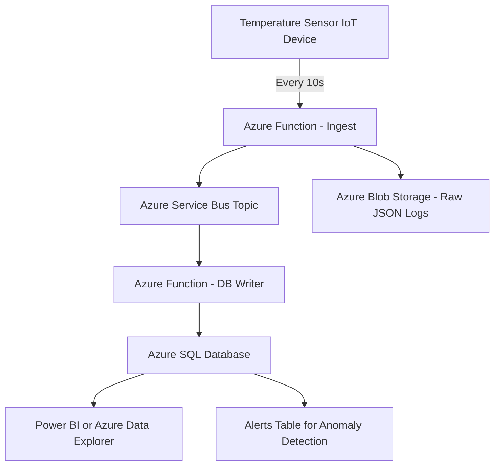
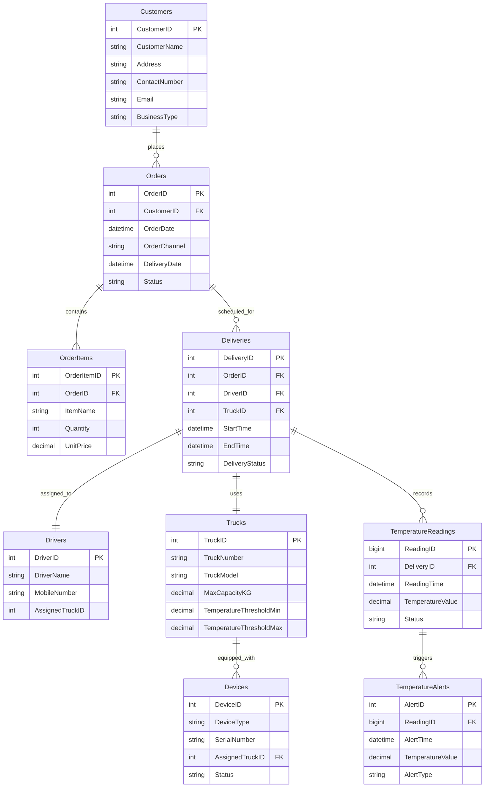

---

### 🍽️ **Scenario Summary:**

Client is the UK's leading food service delivery and collection provider. It supplies food items across the UK to customers of varied business like restaurants, cafes etc. It delivers high-quality food items to 30,000 plus customers. Client had two sales channels - website and call center through which customers order online and also request for delivery of food items. To make the business process more efficient and intelligent, client wanted to automate the business by taking a step further where drivers could deliver through IoT-connected mobile devices such as Bluetooth printers and Bluetooth temperature sensors mounted in trucks. By deploying this advanced technology client wanted to provide a differentiated service and delight customers. During the delivery of items, if the temperature is not optimal then there is a risk of customer returning the goods. To avoid this situation, client wanted to monitor the real-time temperature of the truck periodically and check if it is within the optimal range and doesn’t go beyond the standard temperature limits or thresholds. Client needed the real-time temperature sensor data tracking for every 10 seconds and its visual output for analytics.

The client delivers food items to over 30,000 customers across the UK via two primary channels: **website** and **call center**. The client aims to:

- Use **IoT-connected devices** like Bluetooth temperature sensors and printers.
- Monitor **real-time truck temperature every 10 seconds**.
- Raise alerts if the **temperature exceeds thresholds**.
- Reduce return risk by ensuring **cold chain integrity**.
- Enable **real-time analytics** on delivery data.

---

### 🛠️ SQL Database Tables (with explanation)

#### 1. **Customers**
```sql
CREATE TABLE Customers (
    CustomerID INT PRIMARY KEY,
    CustomerName VARCHAR(255),
    Address TEXT,
    ContactNumber VARCHAR(20),
    Email VARCHAR(100),
    BusinessType VARCHAR(100) -- e.g., restaurant, cafe, etc.
);
```

#### 2. **Orders**
```sql
CREATE TABLE Orders (
    OrderID INT PRIMARY KEY,
    CustomerID INT,
    OrderDate DATETIME,
    OrderChannel VARCHAR(50), -- Website or Call Center
    DeliveryDate DATETIME,
    Status VARCHAR(50), -- e.g., Scheduled, In-Transit, Delivered, Returned
    FOREIGN KEY (CustomerID) REFERENCES Customers(CustomerID)
);
```

#### 3. **OrderItems**
```sql
CREATE TABLE OrderItems (
    OrderItemID INT PRIMARY KEY,
    OrderID INT,
    ItemName VARCHAR(255),
    Quantity INT,
    UnitPrice DECIMAL(10,2),
    FOREIGN KEY (OrderID) REFERENCES Orders(OrderID)
);
```

#### 4. **Drivers**
```sql
CREATE TABLE Drivers (
    DriverID INT PRIMARY KEY,
    DriverName VARCHAR(100),
    MobileNumber VARCHAR(20),
    AssignedTruckID INT
);
```

#### 5. **Trucks**
```sql
CREATE TABLE Trucks (
    TruckID INT PRIMARY KEY,
    TruckNumber VARCHAR(50),
    TruckModel VARCHAR(100),
    MaxCapacityKG DECIMAL(10,2),
    TemperatureThresholdMin DECIMAL(5,2),
    TemperatureThresholdMax DECIMAL(5,2)
);
```

#### 6. **Deliveries**
```sql
CREATE TABLE Deliveries (
    DeliveryID INT PRIMARY KEY,
    OrderID INT,
    DriverID INT,
    TruckID INT,
    StartTime DATETIME,
    EndTime DATETIME,
    DeliveryStatus VARCHAR(50), -- e.g., On Route, Completed, Failed
    FOREIGN KEY (OrderID) REFERENCES Orders(OrderID),
    FOREIGN KEY (DriverID) REFERENCES Drivers(DriverID),
    FOREIGN KEY (TruckID) REFERENCES Trucks(TruckID)
);
```

#### 7. **TemperatureReadings**
```sql
CREATE TABLE TemperatureReadings (
    ReadingID BIGINT PRIMARY KEY,
    DeliveryID INT,
    ReadingTime DATETIME,
    TemperatureValue DECIMAL(5,2), -- e.g., in Celsius
    Status VARCHAR(20), -- e.g., Normal, Alert
    FOREIGN KEY (DeliveryID) REFERENCES Deliveries(DeliveryID)
);
```

#### 8. **TemperatureAlerts**
```sql
CREATE TABLE TemperatureAlerts (
    AlertID INT PRIMARY KEY,
    ReadingID BIGINT,
    AlertTime DATETIME,
    TemperatureValue DECIMAL(5,2),
    AlertType VARCHAR(50), -- e.g., Above Threshold, Below Threshold
    FOREIGN KEY (ReadingID) REFERENCES TemperatureReadings(ReadingID)
);
```

#### 9. **Devices**
```sql
CREATE TABLE Devices (
    DeviceID INT PRIMARY KEY,
    DeviceType VARCHAR(50), -- e.g., TemperatureSensor, BluetoothPrinter
    SerialNumber VARCHAR(100),
    AssignedTruckID INT,
    Status VARCHAR(50), -- Active, Inactive, Maintenance
    FOREIGN KEY (AssignedTruckID) REFERENCES Trucks(TruckID)
);
```

---

### 📊 Use Cases Supported

| Use Case | Tables Involved |
|----------|-----------------|
| Customer places an order | Customers, Orders, OrderItems |
| Assign driver and truck for delivery | Deliveries, Drivers, Trucks |
| Attach IoT device to truck | Devices |
| Record temperature every 10s | TemperatureReadings |
| Alert on temperature violation | TemperatureAlerts |
| Analytics and reporting | TemperatureReadings, Deliveries, Orders |

---

### 📈 Example Queries for Analytics

**1. Find deliveries with temperature alerts:**
```sql
SELECT d.DeliveryID, o.OrderID, c.CustomerName, tr.TemperatureValue, tr.ReadingTime
FROM TemperatureAlerts ta
JOIN TemperatureReadings tr ON ta.ReadingID = tr.ReadingID
JOIN Deliveries d ON tr.DeliveryID = d.DeliveryID
JOIN Orders o ON d.OrderID = o.OrderID
JOIN Customers c ON o.CustomerID = c.CustomerID;
```

**2. Average delivery temperature per truck:**
```sql
SELECT t.TruckNumber, AVG(tr.TemperatureValue) AS AvgTemp
FROM TemperatureReadings tr
JOIN Deliveries d ON tr.DeliveryID = d.DeliveryID
JOIN Trucks t ON d.TruckID = t.TruckID
GROUP BY t.TruckNumber;
```

**3. Orders with sustained temperature issues (>3 consecutive readings out of range):**
```sql
SELECT DeliveryID, COUNT(*) AS AlertCount
FROM TemperatureReadings
WHERE Status = 'Alert'
GROUP BY DeliveryID
HAVING COUNT(*) >= 3;
```

---

Would you like a **Mermaid ER diagram** or **Power BI schema** for visualization?


Based on the solution you described, we'll need to design a relational SQL database that supports the client's logistics, order, delivery, and IoT monitoring capabilities. Here's a breakdown of the SQL database tables required to meet the needs of:

1. **Customers placing orders via web or call center**  
2. **Drivers delivering goods using IoT-connected devices**  
3. **Bluetooth temperature sensors sending real-time readings every 10 seconds**  
4. **Analytics and monitoring to identify deliveries with abnormal temperatures**

---

## ✅ Database Tables (with relationships)

### 1. `Customers`
Stores information about each customer.

```sql
CREATE TABLE Customers (
    CustomerID INT PRIMARY KEY IDENTITY,
    Name NVARCHAR(100),
    BusinessType NVARCHAR(50),
    Address NVARCHAR(255),
    City NVARCHAR(50),
    PostalCode NVARCHAR(20),
    PhoneNumber NVARCHAR(20),
    Email NVARCHAR(100)
);
```

---

### 2. `Orders`
Tracks individual orders placed by customers.

```sql
CREATE TABLE Orders (
    OrderID INT PRIMARY KEY IDENTITY,
    CustomerID INT FOREIGN KEY REFERENCES Customers(CustomerID),
    OrderDate DATETIME,
    OrderChannel NVARCHAR(20), -- 'Web' or 'Call Center'
    TotalAmount DECIMAL(10,2),
    DeliveryStatus NVARCHAR(50),
    ScheduledDeliveryTime DATETIME
);
```

---

### 3. `OrderItems`
Stores items associated with each order.

```sql
CREATE TABLE OrderItems (
    OrderItemID INT PRIMARY KEY IDENTITY,
    OrderID INT FOREIGN KEY REFERENCES Orders(OrderID),
    ItemName NVARCHAR(100),
    Quantity INT,
    Unit NVARCHAR(10), -- e.g., 'kg', 'ltr'
    PricePerUnit DECIMAL(10,2)
);
```

---

### 4. `Drivers`
Stores driver information who deliver the orders.

```sql
CREATE TABLE Drivers (
    DriverID INT PRIMARY KEY IDENTITY,
    Name NVARCHAR(100),
    PhoneNumber NVARCHAR(20),
    VehicleNumber NVARCHAR(20)
);
```

---

### 5. `Deliveries`
Represents each delivery attempt or session.

```sql
CREATE TABLE Deliveries (
    DeliveryID INT PRIMARY KEY IDENTITY,
    OrderID INT FOREIGN KEY REFERENCES Orders(OrderID),
    DriverID INT FOREIGN KEY REFERENCES Drivers(DriverID),
    DeliveryStartTime DATETIME,
    DeliveryEndTime DATETIME,
    DeliveryStatus NVARCHAR(50)
);
```

---

### 6. `BluetoothDevices`
Stores IoT device metadata (printer or temperature sensor).

```sql
CREATE TABLE BluetoothDevices (
    DeviceID INT PRIMARY KEY IDENTITY,
    DeviceType NVARCHAR(50), -- 'TemperatureSensor', 'Printer'
    DeviceSerialNumber NVARCHAR(100),
    VehicleNumber NVARCHAR(20), -- Mounted truck ID
    Status NVARCHAR(50) -- 'Active', 'Inactive'
);
```

---

### 7. `TemperatureReadings`
Stores real-time temperature data from the sensors every 10 seconds.

```sql
CREATE TABLE TemperatureReadings (
    ReadingID BIGINT PRIMARY KEY IDENTITY,
    DeviceID INT FOREIGN KEY REFERENCES BluetoothDevices(DeviceID),
    DeliveryID INT FOREIGN KEY REFERENCES Deliveries(DeliveryID),
    RecordedTime DATETIME,
    TemperatureCelsius DECIMAL(5,2),
    IsOutOfRange BIT -- 1 if outside optimal range
);
```

---

### 8. `TemperatureThresholds`
Stores optimal and threshold temperature ranges.

```sql
CREATE TABLE TemperatureThresholds (
    ThresholdID INT PRIMARY KEY IDENTITY,
    MinTemp DECIMAL(5,2),
    MaxTemp DECIMAL(5,2),
    EffectiveFrom DATETIME,
    EffectiveTo DATETIME NULL
);
```

---

### 9. `Alerts`
Stores any temperature alert records for analytics and notification.

```sql
CREATE TABLE Alerts (
    AlertID INT PRIMARY KEY IDENTITY,
    ReadingID BIGINT FOREIGN KEY REFERENCES TemperatureReadings(ReadingID),
    AlertTime DATETIME,
    TemperatureCelsius DECIMAL(5,2),
    AlertMessage NVARCHAR(255)
);
```

---

## 📊 Relationships Summary
- `Customers` → `Orders` → `OrderItems`
- `Orders` → `Deliveries` → `TemperatureReadings`
- `Drivers` assigned to `Deliveries`
- `BluetoothDevices` mounted in trucks send `TemperatureReadings`
- `TemperatureReadings` compared against `TemperatureThresholds`
- Out-of-threshold readings generate `Alerts`

---

Let me know if you want:
- Sample data inserts
- Power BI schema for visualizing sensor readings
- Stored procedures for recording and alerting on sensor data
- Real-time ingestion pipeline using Azure Functions or IoT Hub

---

## ✅ Updated IoT Delivery Tracking Solution – Azure-Based Architecture

### 🧭 Architecture Overview



---

### 🔹 Key Azure Services

| Service | Role |
|--------|------|
| **Azure Service Bus** | Temporarily buffers real-time temperature readings |
| **Azure Blob Storage** | Stores raw telemetry data (JSON) for long-term, low-cost storage |
| **Azure Functions** | Serverless handlers for ingestion, processing, and database writing |
| **Azure SQL Database** | Main transactional database for analytics/reporting |
| **Power BI** | Dashboards and visual insights |
| **Azure Monitor / Logic App** | Optionally used for triggering alerts |

---
 **Entity-Relationship (ER) Diagram** based on the SQL schema I shared earlier. This will give you a **visual overview** of how everything connects in the system – from customers and orders to real-time temperature tracking and IoT device integration.

---

### 📌 **Mermaid ER Diagram**



---

### 🧠 Suggestions for Power BI Visualization

In **Power BI**, you can use the above schema to create visual dashboards:

#### 🔍 Suggested Dashboards:
1. **Real-time Temperature Dashboard**
   - Line chart: `TemperatureReadings.TemperatureValue` over `ReadingTime`
   - Filters: `TruckID`, `DeliveryID`, `Status`

2. **Alerts Overview**
   - KPI card: Total Alerts Today
   - Table: `TemperatureAlerts` by `TruckID`, `AlertType`

3. **Delivery Risk Heatmap**
   - Matrix: Customer vs. Alert Count
   - Color-coded for "High Risk" deliveries

4. **Cold Chain Compliance Report**
   - % of deliveries within optimal temperature range
   - Bar chart: Deliveries with >3 alerts

---

Would you like help with the Power BI data model or a sample .pbix structure?

## 📦 Database Tables (Updated with Azure Metadata)

### 1. `TemperatureReadings` – Updated for Azure Ingestion

```sql
CREATE TABLE TemperatureReadings (
    ReadingID BIGINT PRIMARY KEY IDENTITY,
    DeliveryID INT FOREIGN KEY REFERENCES Deliveries(DeliveryID),
    DeviceID INT FOREIGN KEY REFERENCES BluetoothDevices(DeviceID),
    ServiceBusMessageID UNIQUEIDENTIFIER, -- message tracking
    RecordedTime DATETIME,
    TemperatureCelsius DECIMAL(5,2),
    IsOutOfRange BIT,
    BlobUri NVARCHAR(2083) -- link to raw JSON stored in Azure Blob
);
```

### 2. `BlobStorageLogs`

Optional metadata tracking of blobs stored (for analytics or cost tracking).

```sql
CREATE TABLE BlobStorageLogs (
    BlobID INT PRIMARY KEY IDENTITY,
    BlobUri NVARCHAR(2083),
    BlobContainer NVARCHAR(100),
    BlobName NVARCHAR(255),
    ContentType NVARCHAR(50),
    UploadedOn DATETIME,
    DeviceID INT,
    DeliveryID INT
);
```

### 3. `ServiceBusLogs`

To log message flow and diagnostics from Azure Service Bus.

```sql
CREATE TABLE ServiceBusLogs (
    LogID INT PRIMARY KEY IDENTITY,
    MessageID UNIQUEIDENTIFIER,
    EnqueuedTimeUtc DATETIME,
    ProcessedTimeUtc DATETIME,
    Status NVARCHAR(50), -- Success, Failed, Duplicate, etc.
    ErrorMessage NVARCHAR(1000) NULL
);
```

---

## 🛠 How It Works – End to End Flow

1. **IoT device** captures temperature every 10 seconds.
2. Azure Function picks it up and:
   - Publishes JSON message to **Azure Service Bus Topic**.
   - Simultaneously logs the raw JSON into **Azure Blob Storage**.
3. Another Azure Function (triggered by Service Bus):
   - Reads the message.
   - Inserts into `TemperatureReadings`, updates `BlobUri`, logs in `ServiceBusLogs`.
4. Optional: An alert rule runs that:
   - Checks if `IsOutOfRange = 1`
   - Creates entries in `Alerts` table
   - Sends email or SMS via Logic App

---

## 📊 Reporting via Power BI

Power BI connects to:
- **Azure SQL** for live metrics, trends, delivery exceptions
- **Blob Storage** (via Dataflow or Synapse) for historical trend analysis

---

Would you like:
- Sample JSON payload for Service Bus message?
- Azure Function code to process messages and insert into SQL?
- Bicep/Terraform deployment template for the resources?

Let me know! I can also generate a full animated diagram or deployment flow if that helps.
